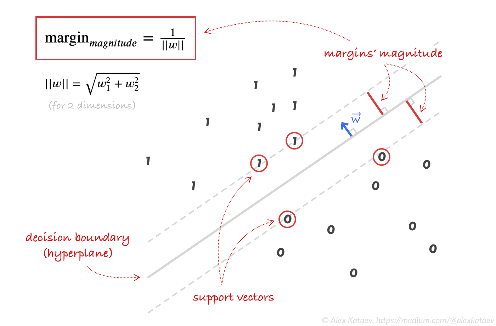

# SVM

The Support Vector Machine (SVM) finds a hyperplane from the training data such that the target classes lie on either side of the plane, with the goal of maximizing the margin between classes.

### Genral concept

Suppose the separating hyperplane is defined as $f(\vec{x}) = 0$, where  $\vec{x} = (x_1, x_2, \dots, x_n), \quad y \in \{-1, +1\}$

- For a positive class: $f(\vec{x}_i) > 0 \! \Rightarrow y_i = +1$
- For a negative class:  $f(\vec{x}_i) < 0 \! \Rightarrow y_i = -1$

Thus the condition for correct classification is:     $y_i f(\vec{x}_i) > 0, \quad \forall i$

### Linear case

For a linear classifier:  $f(\vec{x}) = \vec{w}\cdot \vec{x} + b$

So:  $y_i(\vec{w}\cdot \vec{x}_i + b) > 0$

Here:

- $\vec{w} = (w_1, w_2, \dots, w_n)$ is normal to the hyperplane.
- $b$ is the bias (intercept).

Define two **margin boundaries**:

$\vec{w}\cdot \vec{x} + b = +1, \quad \vec{w}\cdot \vec{x} + b = -1$

- Distance between them = $\tfrac{2}{|\vec{w}|}$
- Optimization goal: **maximize margin**.

**Hard-margin primal problem**:

<aside>

$\min_{\vec{w}, b} \;\; \tfrac{1}{2}\|\vec{w}\|^2 \quad \text{subject to } y_i(\vec{w}\cdot \vec{x}_i + b) \ge 1, \;\; \forall i$

</aside>

### Introducing  regularization

Real-world data is rarely perfectly separable.  I ntroduce **slack variables**  to allow violations of the margin: ${y_i} (\vec{w} \cdot \vec{x_i} + b) \ge 1 - \xi_i$

The **primal objective** becomes: $\min_{w, b, \xi} \frac{1}{2} \|w\|^2 + C \sum_{i=1}^n \xi_i$ subject to  $y_i (\vec{w} \cdot \vec{x_i} + b) \ge 1 - \xi_i$

- $C > 0$ is the **regularization parameter**:
    - Large $C$ → penalizes margin violations heavily → closer to hard margin.
    - Small $C$ → allows more violations → softer margin.

### Lagrange multiplier and dual problem

Introduce **Lagrange multipliers** $\alpha_i \geq 0$ (one for each constraint):

$\mathcal{L}(\vec{w}, \beta, \{\alpha\}) = \frac{1}{2}\|w\|^2 - \sum_{i=1}^n \alpha_i \big(y_i (\vec{w} \cdot \vec{x_i} + \beta) - 1\big)$

Take derivatives of $\mathcal{L}$  w.r.t. $w$ and $\beta$ and set them to zero:

- For $\vec{w}$ : $\frac{\partial L}{\partial \vec{w}} = \vec{w} - \sum_i \alpha_i y_i \vec{x_i} = 0$   so: $\vec{w} = \sum_i \alpha_i y_i \vec{x_i}$
- For $\beta$: $\frac{\partial L}{\partial \beta} = -\sum_i \alpha_i y_i = 0$

Plugging $\vec{w} = \sum_i \alpha_i y_i \vec{x_i}$  back into the Lagrangian gives the **dual optimization problem**:

 

$\max_{\alpha} \; \sum_{i=1}^n \alpha_i - \tfrac{1}{2} \sum_{i=1}^n \sum_{j=1}^n \alpha_i \alpha_j y_i y_j (x_i \cdot x_j)$
 subject to: $\alpha_i \geq 0, \quad \sum_{i=1}^n \alpha_i y_i = 0$

 

### Kernel formulation

The decision function in primal form is:  $f(x) = \text{sign}(\vec{w} \cdot \vec{x} + b)$

Substitute $\vec{w} = \sum_i \alpha_i y_i \vec{x_i}$  $\Rightarrow$   $f(\vec{x}) = \text{sign}\!\left( \left( \sum_i \alpha_i y_i \vec{x_i} \right) \cdot \vec{x} + b \right)$

Expand the dot product:   $f(\vec{x}) = \text{sign}\!\left( \sum_i \alpha_i y_i (\vec{x_i} \cdot \vec{x}) + b \right)$, here i sums not all the training points, but only for support vectors (training points which lies on margins) i.e Only support vectors have $\alpha_i > 0$

Now replace dot products with a **kernel function**:   $K(\vec{x}_i, \vec{x}) = \phi(\vec{x}_i)^\top \phi(\vec{x})$

 
So the **general decision function** is:   $f(\vec{x}) = \text{sign}\!\left(\sum_{i \in \text{SV}} \alpha_i y_i K(\vec{x}_i, \vec{x}) + b \right)$

 

- Only **support vectors** ($\alpha_i > 0$) contribute.
- Popular kernels:
    - Linear:  $K(\vec{x}_i, \vec{x}) = \vec{x}_i^\top \vec{x}$
    - Polynomial: $K(\vec{x}_i, \vec{x}) = (\vec{x}_i^\top \vec{x} + 1)^d$
    - RBF: $K(\vec{x}_i, \vec{x}) = \exp(-\gamma |\vec{x}_i - \vec{x}|^2)$

### Why $i \in \rm{Support Vector}$ ?

- For an SVM, the **KKT (Karush–Kuhn–Tucker) conditions** hold at optimality. The primal constraints were: $y_i (\vec{w} \cdot \vec{x_i} + \beta) \geq 1$
- The dual variable $\alpha_i$ is tied to this constraint. KKT complementarity condition says: $\alpha_i \, \big( y_i (\vec{w} \cdot \vec{x_i} + \beta) - 1 \big) = 0$

So:

- If $\alpha_i > 0$, then the constraint must be **active**, i.e.  $y_i (w \cdot x_i + b) = 1$   → Point lies **exactly on the margin** → this is a **support vector**.
- If $\alpha_i = 0$, then the constraint is **inactive**, i.e.  $y_i (w \cdot x_i + b) > 1$  → Point lies **outside the margin** → not a support vector.

### Interpreting Kernels as Similarity Measures

At its core, a kernel function $K(\vec{x}_i, \vec{x}_j)$ measures the **similarity** between two points $\vec{x}_i$ and $\vec{x}_j$ in some feature space.

* Large $K(\vec{x}_i, \vec{x}_j)$ → the points are “similar.”
* Small $K(\vec{x}_i, \vec{x}_j)$ → the points are “dissimilar.”

Different kernels encode different notions of similarity:

1. **Linear kernel**

   $$
   K(\vec{x}_i, \vec{x}_j) = \vec{x}_i^\top \vec{x}_j
   $$

   * Measures the **dot product** (alignment) between vectors.
   * Closely related to **cosine similarity** or **Pearson correlation** (if data is centered and normalized).
   * Works well when classes are roughly linearly separable.

2. **Polynomial kernel**

   $$
   K(\vec{x}_i, \vec{x}_j) = (\vec{x}_i^\top \vec{x}_j + c)^d
   $$

   * Measures similarity of not just raw features but also their **interactions up to degree $d$**.
   * Useful when class boundaries depend on feature combinations (e.g., XOR-type problems).

3. **Radial Basis Function (RBF) / Gaussian kernel**

   $$
   K(\vec{x}_i, \vec{x}_j) = \exp(-\gamma \|\vec{x}_i - \vec{x}_j\|^2)
   $$

   * Based on **Euclidean distance** between points.
   * High value if $\vec{x}_i$ and $\vec{x}_j$ are close; decays exponentially with distance.
   * Captures **local similarity**, leading to highly flexible nonlinear boundaries.
 

### Final Kernelized Dual Optimization Problem

$\max_{\alpha} \;\; \sum_{i=1}^n \alpha_i \;-\; \tfrac{1}{2} \sum_{i=1}^n \sum_{j=1}^n \alpha_i \alpha_j y_i y_j K(\vec{x}_i, \vec{x}_j)$

subject to:

$0 \le \alpha_i \le C, \quad \sum_{i=1}^n \alpha_i y_i = 0$

This is the **general dual formulation of SVM with kernels and regularization parameter $C$**.

### Why Kernel Method Helps Introduce Non-linearity

- In many datasets, classes are **not linearly separable** in the original input space.
- One idea is to **map data to a higher-dimensional feature space** using a transformation $\phi(\vec{x})$.
    - Example: for $\vec{x} = (x_1, x_2)$, we might add nonlinear features like $x_1^2, x_2^2, x_1x_2, \dots$
    - In this new feature space, the data may become linearly separable.

**Problem:** Explicitly computing all these extra features can be very expensive (sometimes infinite-dimensional).

**Solution:** Use a **kernel function**

$K(\vec{x}_i, \vec{x}_j) = \phi(\vec{x}_i)^\top \phi(\vec{x}_j)$

- Kernels let us compute the **inner product in feature space** *without ever computing $\phi(\vec{x})$ explicitly*.
- This trick is known as the **“kernel trick”**.

**Advantage:**

- Introduces nonlinearity efficiently.
- Keeps the optimization problem in the same form as the linear case.
- Avoids explicit computation of high-dimensional features.

**Example:**

- Suppose we want a polynomial mapping of degree $d=2$. Explicitly, this would mean computing terms like  $(x_1^2, x_2^2, x_1x_2)$ for every sample.
- But with a kernel:
    
    
    $K(\vec{x}_i, \vec{x}_j) = (\vec{x}_i^\top \vec{x}_j + 1)^2$
    
    this effect is achieved automatically, without ever constructing those features.